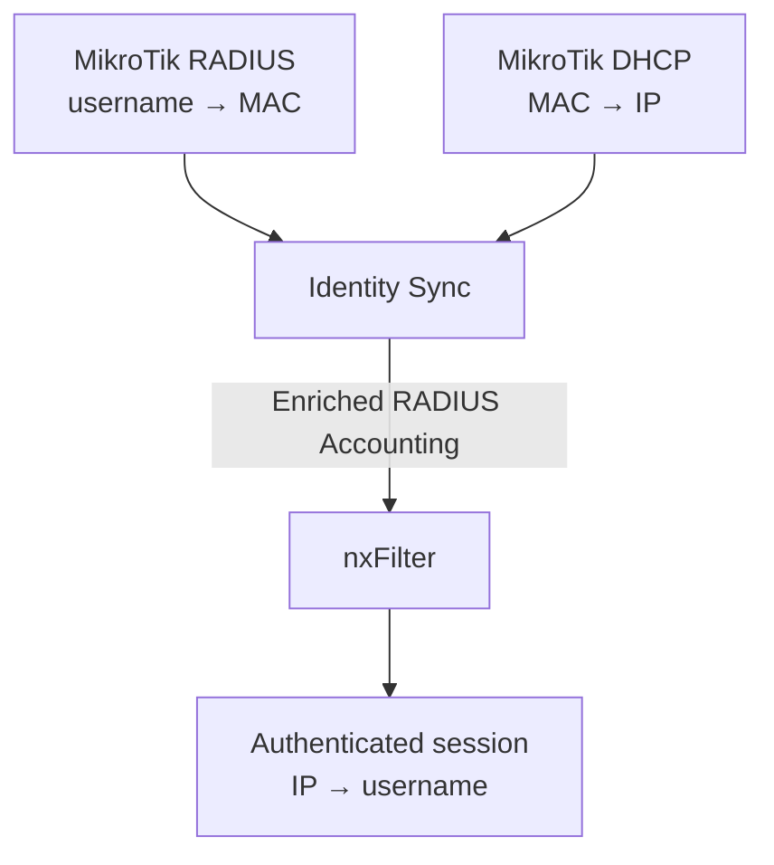

# nxFilter integration

Identity Sync can feed resolved MikroTik identities to **nxFilter 4.7.5.4** by acting as a small RADIUS Accounting client.

This is useful with MikroTik 802.1X because RouterOS accounting packets may contain the authenticated username and client MAC address but no `Framed-IP-Address`. Identity Sync already joins RADIUS and DHCP state, so it can send nxFilter an enriched accounting packet containing the username and actual client IP.



## nxFilter configuration

In nxFilter, open **User > RADIUS** and configure:

- **Use RADIUS:** enabled
- **Accounting Port:** `1813` (default)
- **Shared Secret:** choose a strong shared secret
- **Enable Logout:** enabled
- **Auto-register for New User:** optional

Restart nxFilter after changing the RADIUS settings. nxFilter documents UDP/1813 as its default accounting port and uses `Acct-Status-Type = Stop` to destroy the user login session when **Enable Logout** is enabled.

Restrict UDP/1813 at the host/firewall so only the Identity Sync app/server can send accounting traffic to nxFilter.

## Identity Sync configuration

Enable the backend and set the nxFilter host and the same shared secret:

```text
NXFILTER_ENABLED=true
NXFILTER_HOST=192.168.0.110
NXFILTER_SHARED_SECRET=CHANGE-THIS-SECRET
```

Optional settings:

| Variable | Default | Purpose |
|---|---|---|
| `NXFILTER_ACCOUNTING_PORT` | `1813` | nxFilter RADIUS Accounting UDP port. |
| `NXFILTER_NAS_IDENTIFIER` | `mikrotik-adguard-identity` | NAS-Identifier sent in generated accounting packets. |
| `NXFILTER_TIMEOUT` | `5` | Seconds to wait for an Accounting-Response. |
| `NXFILTER_REFRESH_INTERVAL` | `300` | Seconds between Interim-Update refreshes for active mappings. |

When `NXFILTER_ENABLED=false` (the default), all nxFilter settings are ignored.

## Packets generated

For a resolved identity such as:

```text
alice -> AA:BB:CC:DD:EE:FF -> 192.168.1.50
```

Identity Sync sends an RFC 2866 Accounting-Request containing:

```text
User-Name = alice
Framed-IP-Address = 192.168.1.50
Calling-Station-Id = AA:BB:CC:DD:EE:FF
NAS-Identifier = mikrotik-adguard-identity
Acct-Status-Type = Start / Interim-Update / Stop
Acct-Session-Id = stable synthetic ID for user|MAC|IP
Acct-Authentic = RADIUS
```

The Accounting-Request Authenticator and Accounting-Response Authenticator are validated using the configured shared secret.

## Synchronization behavior

- New resolved user/MAC/IP mapping -> `Start`
- Existing active mapping -> no packet until the refresh interval
- Periodic refresh -> `Interim-Update`
- Mapping disappears -> `Stop`
- Device changes IP -> `Stop` for the old IP, then `Start` for the new IP
- IP changes owner -> `Stop` for the old user, then `Start` for the new user
- Same IP temporarily resolves to multiple users -> no contradictory Start is sent; the IP is left unassigned until state reconciliation resolves the conflict

The nxFilter backend keeps only transient runtime state. After Identity Sync restarts, it reconstructs current RADIUS and DHCP state from RouterOS and sends fresh Start packets for resolved active identities.

## Users

If the RADIUS username does not already exist in nxFilter, enable **Auto-register for New User** or provision the user separately. nxFilter can also assign auto-registered users to a default group.

If usernames arrive in email form, review nxFilter's **Local Domain** behavior because nxFilter may strip the domain portion depending on that setting.

## Compatibility note

The implementation targets nxFilter **4.7.5.4** and the documented nxFilter RADIUS Accounting SSO interface. Packet construction is RFC 2866 compliant. Validate the complete Start/Interim/Stop lifecycle against your nxFilter instance before relying on it for production policy enforcement.
